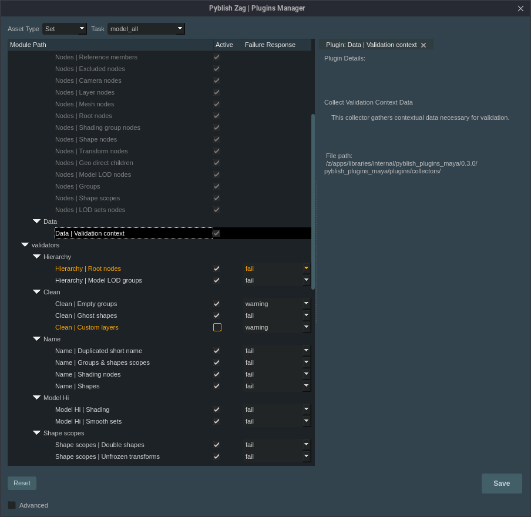

# Pyblish Plugins Manager


`pyblish_plugins_manager` is a tool for managing Pyblish plugins based on asset types and tasks.



## Features

- **Context-Aware Plugin Management**: Enables loading of plugins based on specific production contexts, such as asset types and tasks.

## Usage
### Important Notice:

Currently, the Pyblish Plugins Manager is compatible only with the Maya environment.
Attempts to launch it outside of Maya will result in import errors due to Maya-specific dependencies in the plugin files.

We are aware of this limitation and are working towards making the tool more versatile for use in different environments.
Updates and enhancements will be released in future versions.

Launch the plugin manager from within Maya using the following Python script:

```python
from pyblish_plugins_manager.app import open_plugins_manager

open_plugins_manager()
